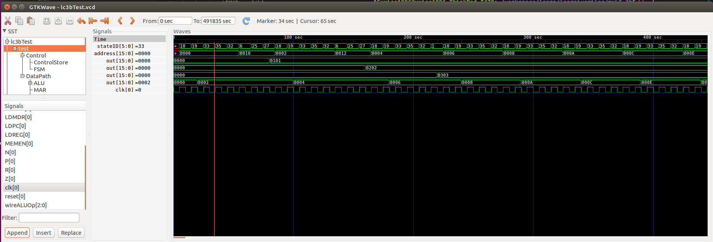

## MY LC-3b EXERCISE

main reference for this exercise is this work:
    https://github.com/alankarkotwal/lc-3b-processor

I tried to refactir their work, and I want to be as close to the implementation in appendix c of classical textbook P&P as possible.

This implementation use a single bus. 

lc3b.v            contains top-level module;

datapath.v        contains datapath module;

control/control.v contains control module;

memory is implemented with registers, so really cannot have 2^16 address space as the ISA(reduce to 2^9).

### simulation result 

1. load word(LDW) and add(ADD)

    